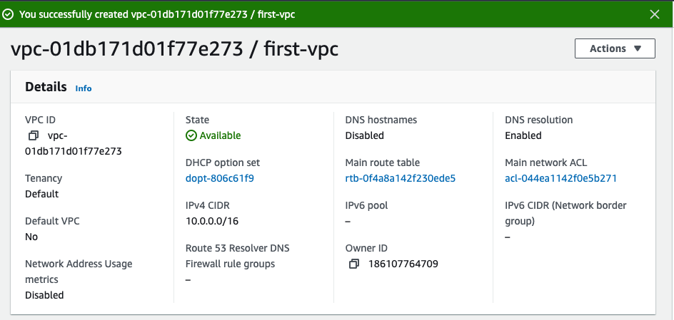
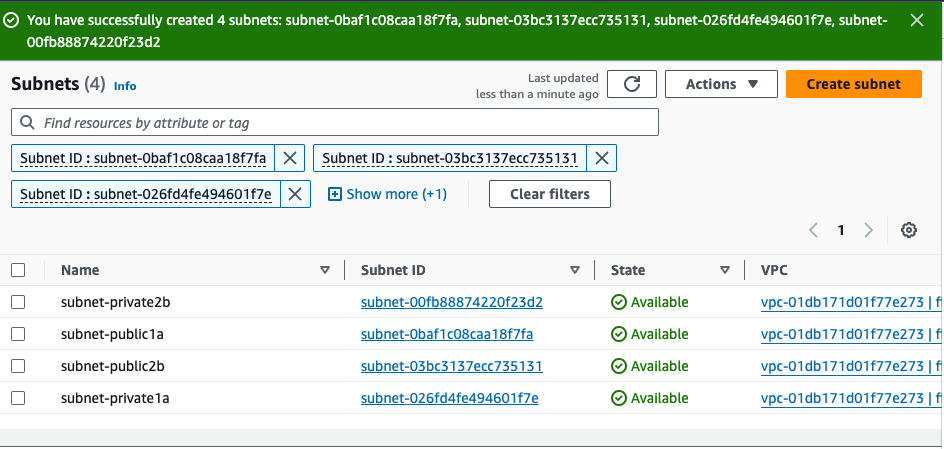
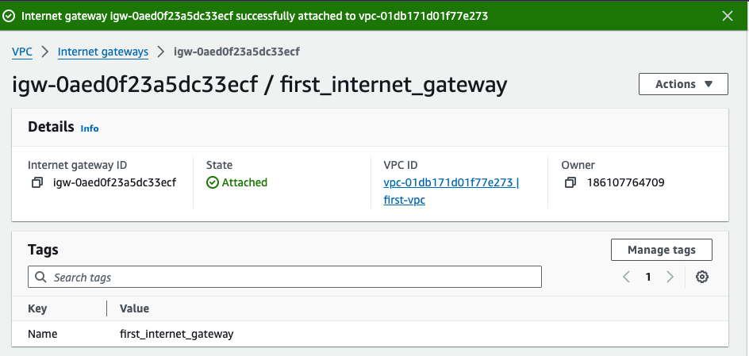
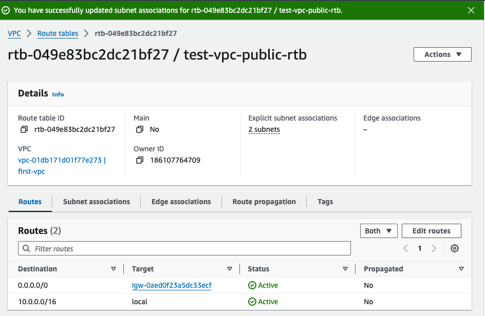
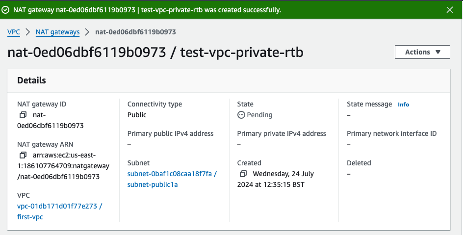
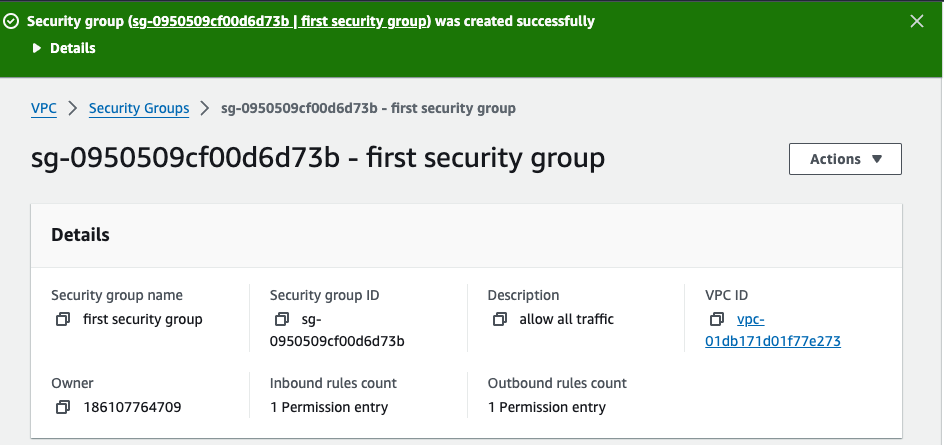
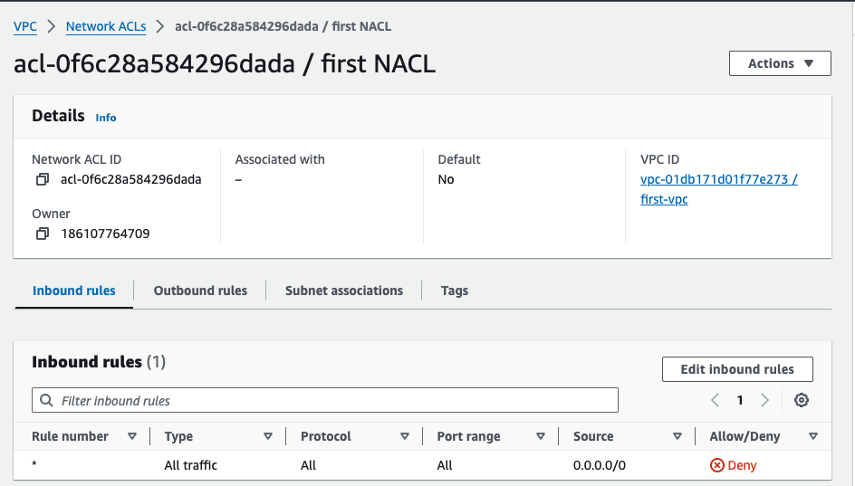

# AWS VPC Implementation Project

## Introduction

This tutorial will guide you through the process of implementing AWS networking, including VPC creation, subnet configuration, internet gateway setup, NAT gateway configuration, and more. Follow the steps carefully and use the spaces provided to attach screenshots as you progress through the project.

---

## Table of Contents

1. [Creating a VPC](#creating-a-vpc)
2. [Creating and Configuring Subnets](#creating-and-configuring-subnets)
3. [Setting Up an Internet Gateway](#setting-up-an-internet-gateway)
4. [Configuring Route Tables](#configuring-route-tables)
5. [Creating a NAT Gateway](#creating-a-nat-gateway)
6. [Security Groups and Network ACLs](#security-groups-and-network-acls)
7. [VPC Peering and VPN Connection](#vpc-peering-and-vpn-connection)

---

## 1. Creating a VPC

1. Go to the VPC dashboard in AWS Management Console.
2. Click on `Create VPC`.
3. Select `VPC only` and enter the following details:
   - Name tag: `first-vpc`
   - IPv4 CIDR block: `10.0.0.0/16`
   - Leave the tags as default, then click `Create VPC`.

**Screenshot 1: VPC Creation**

---

## 2. Creating and Configuring Subnets

1. Navigate to `Subnets` under the VPC dashboard.
2. Click `Create subnet` and select the VPC you created.
3. Enter the following details for each subnet:

   - Public Subnet 1:
     - Name tag: `subnet-public1a`
     - Availability Zone: `us-east-1a`
     - IPv4 CIDR block: `10.0.11.0/24`
     
   - Public Subnet 2:
     - Name tag: `subnet-public2b`
     - Availability Zone: `us-east-1b`
     - IPv4 CIDR block: `10.0.12.0/24`
     
   - Private Subnet 1:
     - Name tag: `subnet-private1a`
     - Availability Zone: `us-east-1a`
     - IPv4 CIDR block: `10.0.1.0/24`
     
   - Private Subnet 2:
     - Name tag: `subnet-private2b`
     - Availability Zone: `us-east-1b`
     - IPv4 CIDR block: `10.0.2.0/24`

**Screenshot 2: Subnet Configuration**

---

## 3. Setting Up an Internet Gateway

1. Go to `Internet Gateways` under the VPC dashboard.
2. Click `Create internet gateway`.
3. Enter a name tag for the internet gateway and click `Create internet gateway`.
4. Attach the internet gateway to your VPC.

**Screenshot 3: Internet Gateway Setup**

---

## 4. Configuring Route Tables

1. Go to `Route Tables` under the VPC dashboard.
2. Click `Create route table` and enter the following details:
   - Name tag: `test-vpc-public-rtb`
   - VPC: Select your VPC

3. Edit the route table:
   - Add a route with destination `0.0.0.0/0` and target as the internet gateway.

4. Associate the route table with the public subnets.

**Screenshot 4: Route Table Configuration**

---

## 5. Creating a NAT Gateway

1. Go to `NAT Gateways` under the VPC dashboard.
2. Click `Create NAT Gateway`.
3. Select a public subnet and allocate an Elastic IP.
4. Create a new route table for the private subnets:
   - Name tag: `test-vpc-private-rtb`
   - VPC: Select your VPC

**Screenshot 5: NAT Gateway Setup**

---

## 6. Security Groups and Network ACLs

1. **Security Groups:**
   - Go to `Security Groups` under the VPC dashboard.
   - Create a security group with rules for inbound and outbound traffic as per your requirements.

2. **Network ACLs:**
   - Go to `Network ACLs` under the VPC dashboard.
   - Create a network ACL and define rules to control traffic at the subnet level.

**Screenshot 6: Security Groups and Network ACLs**

## Summary

By following this tutorial, you have successfully implemented a scalable and secure AWS network infrastructure using VPCs, subnets, internet gateways, NAT gateways, and configured security measures.

---
[AWS VPC Implementation Project Tutorial](#)
