# DevOps Tools and Website Solutions

## Objective
To implement DevOps tools that help maintain daily activities on our WordPress websites.

## Prerequisites
- **Infrastructure**: AWS
- **Web Server OS**: Red Hat Enterprise Linux 8
- **Database Server**: Ubuntu with MySQL
- **Storage Server**: Red Hat with NFS
- **Programming Language**: PHP
- **Code Repository**: GitHub

## Implementing a Business Website Using NFS for Backend Storage

### Step 1: Set Up the Server

1. **Spin up an EC2 Instance with Red Hat OS**:
   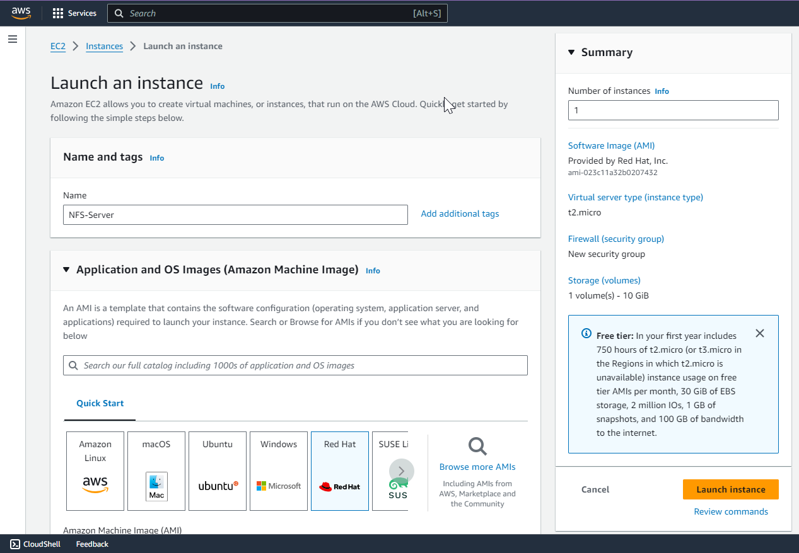

2. **Install the `lvm2` Package**:
   ```bash
   sudo yum install lvm2
   ```
   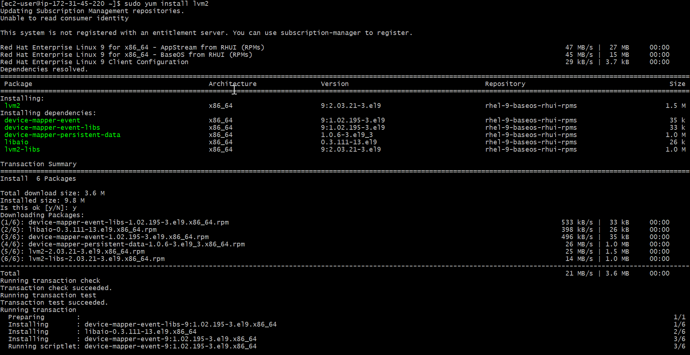

3. **Create Logical Volumes**:
   ```bash
   sudo lvcreate -n lv-apps -L 9G webdata-vg
   sudo lvcreate -n lv-logs -L 9G webdata-vg
   sudo lvcreate -n lv-opt -L 9G webdata-vg
   ```
   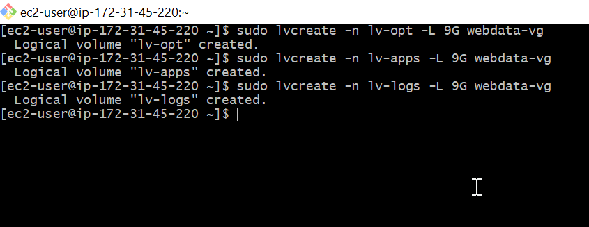

4. **Format the Logical Volumes with XFS File System**:
   ```bash
   sudo mkfs -t xfs /dev/webdata-vg/lv-apps
   sudo mkfs -t xfs /dev/webdata-vg/lv-opt
   sudo mkfs -t xfs /dev/webdata-vg/lv-logs
   ```
   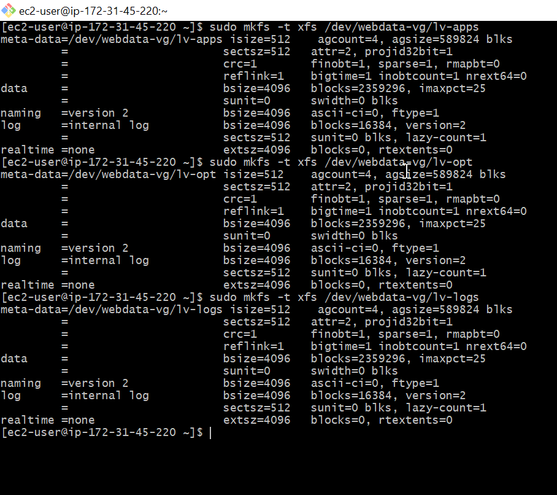

5. **Create Mount Points**:
   ```bash
   sudo mkdir -p /mnt/apps
   sudo mkdir -p /mnt/logs
   sudo mkdir -p /mnt/opt
   ```
   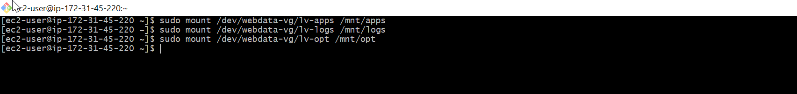

6. **Mount the Logical Volumes**:
   ```bash
   sudo mount /dev/webdata-vg/lv-apps /mnt/apps
   sudo mount /dev/webdata-vg/lv-logs /mnt/logs
   sudo mount /dev/webdata-vg/lv-opt /mnt/opt
   ```

7. **Backup Log Files Using `rsync`**:
   ```bash
   sudo rsync -av /var/log/. /mnt/logs
   ```
   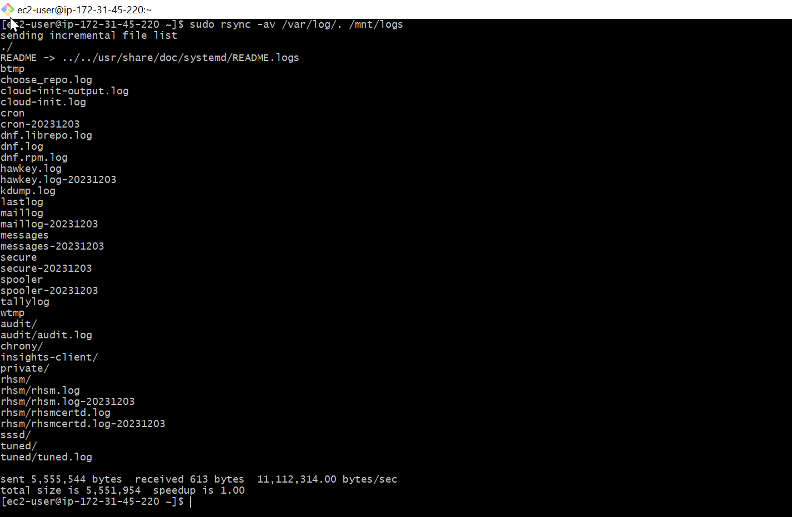

8. **Mount `/var/log` on `lv-logs` Logical Volume**:
   ```bash
   sudo mount /dev/webdata-vg/lv-logs /var/log
   ```
   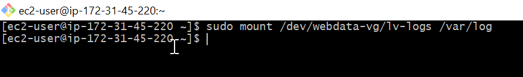

9. **Restore Log Files**:
   ```bash
   sudo rsync -av /mnt/logs/. /var/log
   ```
   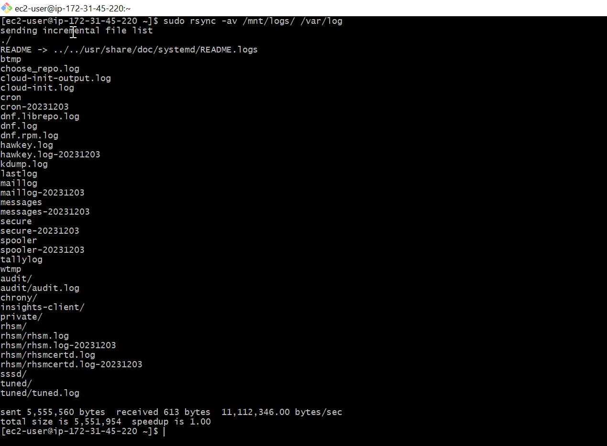

10. **Update `/etc/fstab` for Persistent Mounts**:
    ```bash
    sudo blkid
    ```
    Use the output to update `/etc/fstab`:
    ```
    UUID=<UUID_apps> /mnt/apps xfs defaults 0 0
    UUID=<UUID_opt> /mnt/opt xfs defaults 0 0
    UUID=<UUID_logs> /mnt/logs xfs defaults 0 0
    ```
    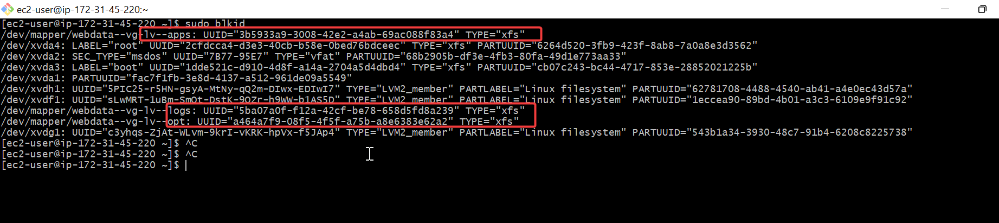
    ```bash
    sudo vi /etc/fstab
    ```

11. **Test Configuration**:
    ```bash
    sudo mount -a
    sudo systemctl daemon-reload
    ```
    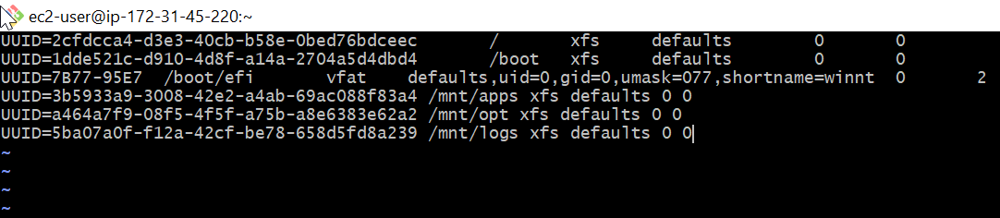

12. **Verify Setup**:
    ```bash
    df -h
    ```
    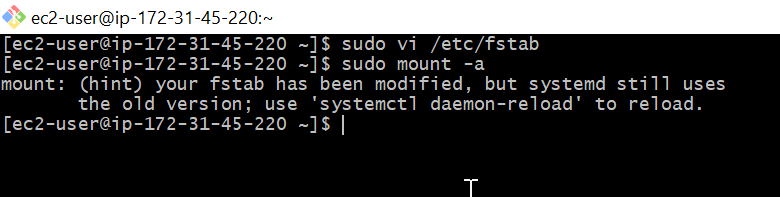

### Step 2: Installing NFS Server

1. **Install NFS Server**:
    ```bash
    sudo yum -y update
    sudo yum install nfs-utils -y
    sudo systemctl start nfs-server.service
    sudo systemctl enable nfs-server.service
    sudo systemctl status nfs-server.service
    ```
    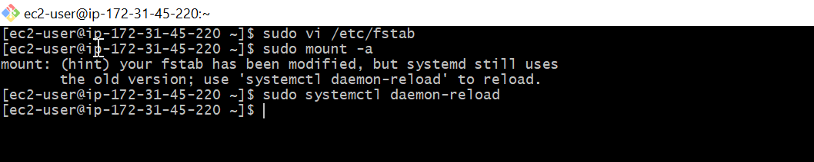

2. **Export Mounts for Web Server Subnet**:
    ```bash
    sudo chown -R nobody: /mnt/apps
    sudo chown -R nobody: /mnt/logs
    sudo chown -R nobody: /mnt/opt
    sudo chmod -R 777 /mnt/apps
    sudo chmod -R 777 /mnt/logs
    sudo chmod -R 777 /mnt/opt
    sudo systemctl restart nfs-server.service
    ```
    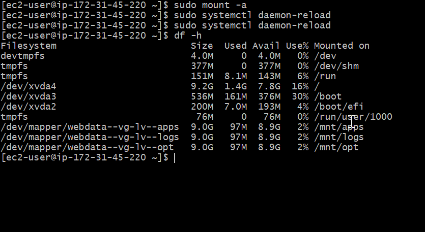

3. **Configure Access to NFS**:
    ```bash
    sudo vi /etc/exports
    /mnt/apps 172.31.32.0/20(rw,sync,no_all_squash,no_root_squash)
    /mnt/logs 172.31.32.0/20(rw,sync,no_all_squash,no_root_squash)
    /mnt/opt  172.31.32.0/20(rw,sync,no_all_squash,no_root_squash)
    sudo exportfs -arv
    ```
    

4. **Check NFS Ports and Open in Security Groups**:
    ```bash
    rpcinfo -p | grep nfs
    ```
    Open TCP/UDP ports 111 and 2049 in security groups.
    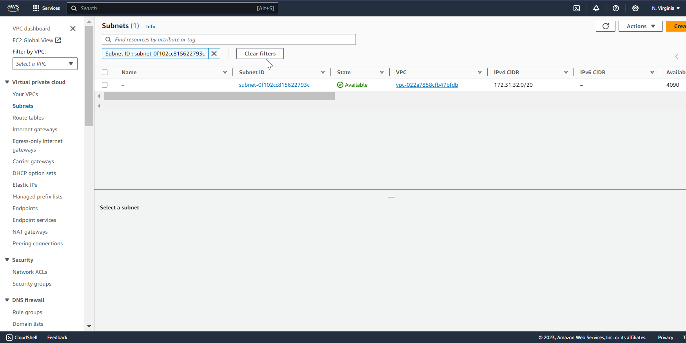

### Step 3: Configuring Backend Database

1. **Launch MySQL Server**:
    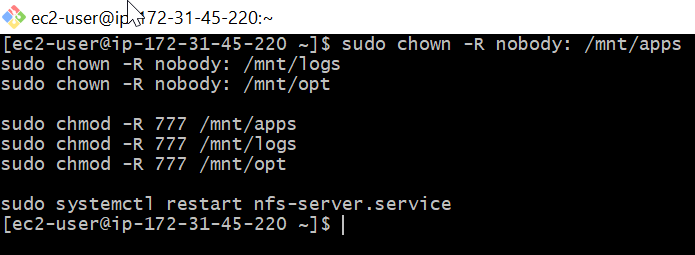

2. **Install MySQL Server**:
    ```bash
    sudo yum update
    sudo yum install mysql-server
    ```
    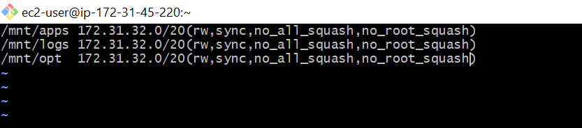

3. **Create Database and User**:
    ```bash
    sudo mysql
    CREATE DATABASE tooling;
    CREATE USER 'webaccess'@'172.31.32.0/20' IDENTIFIED BY 'mypass1';
    GRANT ALL ON tooling.* TO 'webaccess'@'172.31.32.0/20';
    FLUSH PRIVILEGES;
    SHOW DATABASES;
    exit
    ```
    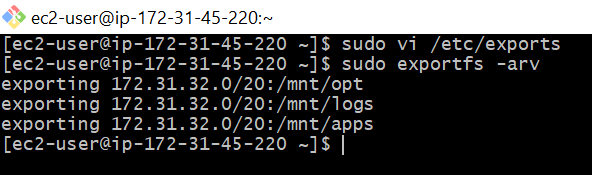

### Step 4: Preparing the Web Servers

1. **Ensure Web Servers Serve the Same Content**:
    - Use NFS for shared storage.
    - Configure the web server to use a single MySQL database.

2. **Install NFS Client on All Web Servers**:
    ```bash
    sudo yum install nfs-utils nfs4-acl-tools -y
    ```
    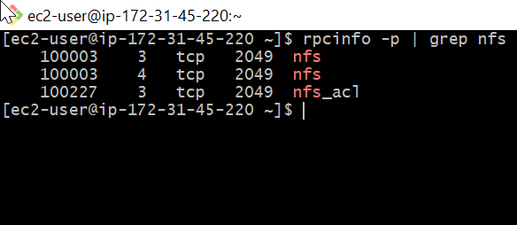

3. **Mount NFS Shares**:
    ```bash
    sudo mkdir /var/www
    sudo mount -t nfs -o rw,nosuid <NFS-Server-Private-IP-Address>:/mnt/apps /var/www
    sudo mount -t nfs -o rw,nosuid <NFS-Server-Private-IP-Address>:/mnt/logs /var/log
    ```
    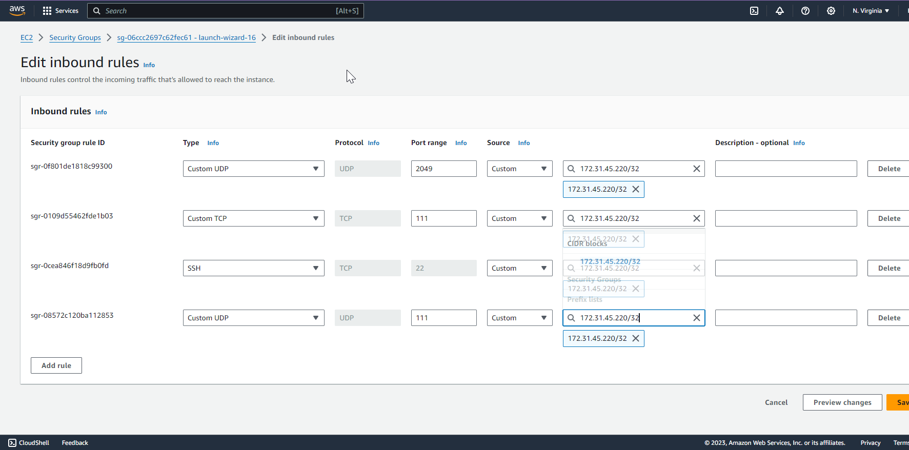
