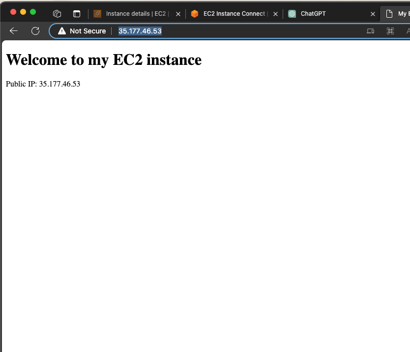
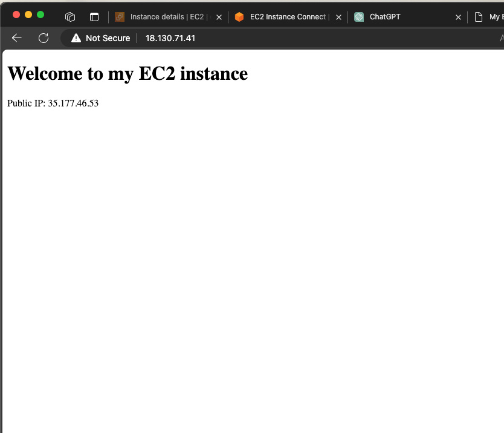

# Using a bash script to configure a load balancer and webserver on AWS

## Configure the webservers

### Launch 3 EC2 instances and use the information below to configure 2 of them


### Copy the script below
```bash
#!/bin/bash

####################################################################################################################
##### This automates the installation and configuring of apache webserver to listen on port 8000
##### Usage: Call the script and pass in the Public_IP of your EC2 instance as the first argument as shown below:
######## ./install_configure_apache.sh 127.0.0.1
####################################################################################################################

set -x # debug mode
set -e # exit the script if there is an error
set -o pipefail # exit the script when there is a pipe failure

PUBLIC_IP=$1

[ -z "${PUBLIC_IP}" ] && echo "Please pass the public IP of your EC2 instance as an argument to the script" && exit 1

sudo apt update -y &&  sudo apt install apache2 -y

sudo systemctl status apache2

if [[ $? -eq 0 ]]; then
    sudo chmod 777 /etc/apache2/ports.conf
    echo "Listen 8000" >> /etc/apache2/ports.conf
    sudo chmod 777 -R /etc/apache2/

    sudo sed -i 's/<VirtualHost \*:80>/<VirtualHost *:8000>/' /etc/apache2/sites-available/000-default.conf

fi
sudo chmod 777 -R /var/www/
echo "<!DOCTYPE html>
        <html>
        <head>
            <title>My EC2 Instance</title>
        </head>
        <body>
            <h1>Welcome to my EC2 instance</h1>
            <p>Public IP: "${PUBLIC_IP}"</p>
        </body>
        </html>" > /var/www/html/index.html

sudo systemctl restart apache2


```

### Open the VI editor and paste the copied script
```bash
sudo vi install.sh
```


### Change the permissions on the script to allow it to run
```bash
sudo chmod +x install.sh

```
### Run the script and pass in the public IP of your EC2 
```bash
./install.sh PUBLIC_IP
```




## Configure the Load Balancer

### Remember to use the steps above to configure two web servers and then use the 3rd EC2 you provisioned for the steps below

### Copy the script below

```bash
#!/bin/bash

######################################################################################################################
##### This automates the configuration of Nginx to act as a load balancer
##### Usage: The script is called with 3 command line arguments. The public IP of the EC2 instance where Nginx is installed
##### the webserver urls for which the load balancer distributes traffic. An example of how to call the script is shown below:
##### ./configure_nginx_loadbalancer.sh PUBLIC_IP Webserver-1 Webserver-2
#####  ./configure_nginx_loadbalancer.sh 127.0.0.1 192.2.4.6:8000  192.32.5.8:8000
############################################################################################################# 

PUBLIC_IP=$1
firstWebserver=$2
secondWebserver=$3

[ -z "${PUBLIC_IP}" ] && echo "Please pass the Public IP of your EC2 instance as the argument to the script" && exit 1

[ -z "${firstWebserver}" ] && echo "Please pass the Public IP together with its port number in this format: 127.0.0.1:8000 as the second argument to the script" && exit 1

[ -z "${secondWebserver}" ] && echo "Please pass the Public IP together with its port number in this format: 127.0.0.1:8000 as the third argument to the script" && exit 1

set -x # debug mode
set -e # exit the script if there is an error
set -o pipefail # exit the script when there is a pipe failure


sudo apt update -y && sudo apt install nginx -y
sudo systemctl status nginx

if [[ $? -eq 0 ]]; then
    sudo touch /etc/nginx/conf.d/loadbalancer.conf

    sudo chmod 777 /etc/nginx/conf.d/loadbalancer.conf
    sudo chmod 777 -R /etc/nginx/

    
    echo " upstream backend_servers {

            # your are to replace the public IP and Port to that of your webservers
            server  "${firstWebserver}"; # public IP and port for webserser 1
            server "${secondWebserver}"; # public IP and port for webserver 2

            }

           server {
            listen 80;
            server_name "${PUBLIC_IP}";

            location / {
                proxy_pass http://backend_servers;   
            }
    } " > /etc/nginx/conf.d/loadbalancer.conf
fi

sudo nginx -t

sudo systemctl restart nginx
```
### Open the VI editor and paste the copied script
```bash
sudo vi install.sh
```

### Change the permissions on the script to allow it to run
```bash
sudo chmod +x install.sh

```
### Run the script and pass the public IP of the load balancer and the public IP of the 2 web servers
```bash
./install.sh PUBLIC_IP firstWebserver secondWebserver
```

### Visit the public URL of the load balancer and refresh to see it switch between the 2 webservers





